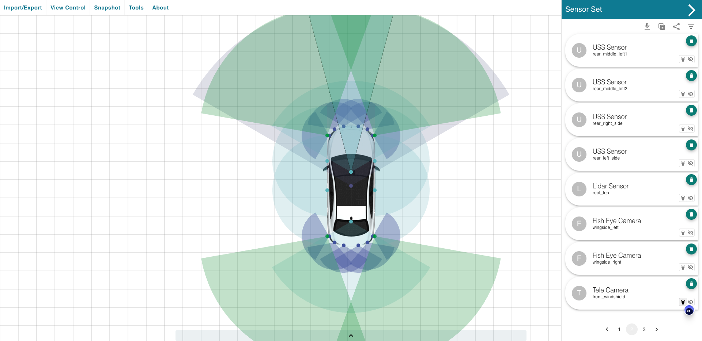

# ADAS Sensor Set Builder

A handy tool for Product Managers/System Engineers to easly create illustration of their product's sensor set

## Features

1. Sensor Set creation and visualization 
2. Highlight and visibility control
3. import/export your data
4. BOM table generation (WIP) 

## TODOs

- [color theme](https://uicolors.app/create) #6aeffb 
- Dark mode
- BOM table generation
- Different mode
  - compare mode
  - editing mode
- Measurement tools/ distance display in Viewer
- Customizable sensor style
- Onboarding Interface
- layer tools
